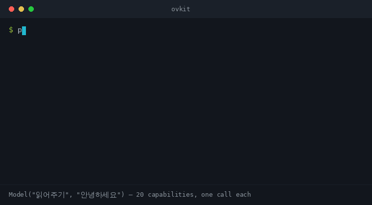

<div align="center">


# ovkit

**OpenVINO inference in 3 lines.** One `Model` class, clean `Results`, 30+
ready models — with `AUTO`/`NPU`/`GPU` devices, async throughput, and INT8.

[](https://github.com/leeyunjai82/ovkit/actions/workflows/ci.yml)
[](https://leeyunjai82.github.io/ovkit/)
[](pyproject.toml)
[](LICENSE)
[](https://huggingface.co/leeyunjai/ovkit-models)
<!-- After the first PyPI release, add:
[](https://pypi.org/project/ovkit/) -->

[Docs](https://leeyunjai82.github.io/ovkit/) ·
[한국어 문서](https://leeyunjai82.github.io/ovkit/ko/) ·
[Model catalog](https://leeyunjai82.github.io/ovkit/models.html) ·
[Examples](examples/)

</div>

```python
from ovkit import Model

r = Model("detect")("image.jpg")[0]   # download -> convert -> cache -> run
r.save("out.jpg")                     # boxes drawn; r.boxes.xyxy / .conf / .cls
```

<!-- Demo GIF: record `python examples/webcam_demo.py` (or the web app) and
     place it at docs/_static/demo.gif, then uncomment:
<div align="center"></div> -->

Or without writing Python at all:

```bash
ovkit run detect image.jpg            # prints results, saves image_out.jpg
```

## Install

```bash
git clone https://github.com/leeyunjai82/ovkit.git && cd ovkit
python -m venv .venv && source .venv/bin/activate   # Windows: .venv\Scripts\activate
pip install -e .
```

<!-- After the first PyPI release this becomes just: pip install ovkit -->
Extras: `".[quant]"` (INT8/NNCF) · `".[genai]"` (LLM/STT) · `".[all]"`.
Python 3.10+.

## Supported tasks

Every task below runs end-to-end through the same 3 lines — swap the alias:

| Task | Alias | Output | Example |
| ---- | ----- | ------ | ------- |
| Object detection | `detect`, `face_detection`, `person_detection`, `vehicle_detection`, `text_detection`, `license_plate` | `r.boxes` | [detect.py](examples/detect.py) |
| Classification | `classify`, `person_attributes`, `vehicle_attributes` | `r.probs` / text | [classify.py](examples/classify.py) |
| Segmentation | `segment`, `instance_segmentation` | `r.masks` | [segment.py](examples/segment.py) |
| Pose / landmarks | `pose`, `face_landmarks` | `r.keypoints` | [pose.py](examples/pose.py) |
| Face analysis | `age_gender`, `emotion`, `head_pose`, `face_reid` | `r.text` (e.g. `"age 31 · male 98%"`) | [face_analysis.py](examples/face_analysis.py) |
| OCR | `text_recognition` | `r.text` | [ocr.py](examples/ocr.py) |
| Super-resolution | `super_resolution` | upscaled image via `r.plot()` | [super_resolution.py](examples/super_resolution.py) |
| LLM / STT (GenAI) | `llm`, `stt` | generated text | [llm.py](examples/llm.py) / [stt.py](examples/stt.py) |
| NLP / audio / time series | `qa`, `translation`, `noise_suppression`, `time_series` | tensors via `model.infer()` | [denoise_audio.py](examples/denoise_audio.py) |

The registry exposes **one well-tested model per capability (35 total)**; the
[HF mirror](https://huggingface.co/leeyunjai/ovkit-models) hosts the full
Apache-2.0 OMZ set (other tiers, `int8`, `sparse` variants) — surfacing a
variant is a one-line edit ([catalog](https://leeyunjai82.github.io/ovkit/models.html)).
`ovkit list` shows everything with descriptions.

## Devices

| Device | How | Notes |
| ------ | --- | ----- |
| **AUTO** (default) | `Model("detect")` | OpenVINO picks the best device |
| **CPU** | `Model("detect", device="CPU")` | works everywhere |
| **GPU** | `device="GPU"` | Intel iGPU / Arc |
| **NPU** | `device="NPU"` | Intel® Core™ Ultra AI accelerator |

Single images run synchronously; `stream=True` uses an `AsyncInferQueue` for
video/webcam throughput. INT8: `model.quantize(calib_images)` (NNCF).

### Benchmarks

```bash
python scripts/benchmark.py        # prints a paste-ready CPU/GPU/NPU table
```

<!-- BENCHMARKS: run scripts/benchmark.py on your Intel hardware and paste the
     generated Markdown table here (model x device, median ms + FPS). -->

## Usage

<details open>
<summary><b>Python</b></summary>

```python
from ovkit import Model

model = Model("face_detection")              # alias, name, .xml, or .onnx
results = model("photo.jpg", conf=0.25)      # image / ndarray / folder / video
for r in model.predict(0, stream=True):      # webcam (lazy generator)
    annotated = r.plot()

print(Model("age_gender")("face.jpg")[0].text)   # "age 31 · male 98%"
```

Inputs are **auto-detected**: image path / `ndarray` / folder / video / camera
index → vision pipeline; `.npy` / `.wav` → raw inference. Grayscale models and
all-image multi-input models (super-resolution) are handled automatically. Full
control for any model: `model.infer({name: tensor})` with `model.inputs`.

| `Results` | holds |
| --------- | ----- |
| `r.boxes` | `xyxy`, `xywh`, `conf`, `cls` |
| `r.masks` / `r.keypoints` / `r.probs` | masks · `[x,y,conf]` · `top1`/`top5` |
| `r.text` | decoded text (OCR, face attributes) |
| `r.tensors` | raw `{name: ndarray}` |
| `r.plot()` / `r.save(path)` | annotated image (or the model's output image) |

</details>

<details>
<summary><b>CLI</b></summary>

```bash
ovkit run detect image.jpg --save out.jpg   # one-shot inference
ovkit run age_gender face.jpg --device NPU
ovkit list                                  # aliases + models with descriptions
ovkit info face_detection                   # source / task / license
ovkit download detect                       # warm the cache
ovkit devices                               # available OpenVINO devices
```

</details>

<details>
<summary><b>GenAI (LLM / speech-to-text)</b></summary>

```python
from ovkit.genai import pipeline

llm = pipeline("llm")                        # tinyllama_chat from the mirror
print(llm.generate("Explain OpenVINO in one sentence.", max_new_tokens=64))

stt = pipeline("stt")                        # whisper_base
print(stt.generate(audio_16k_mono_float32))
```

Needs `pip install -e ".[genai]"`.

</details>

<details>
<summary><b>Web demo (image / webcam / audio / text)</b></summary>

```bash
pip install -r examples/requirements.txt
python examples/web_app.py                   # http://127.0.0.1:8000
```

Pick any model — the right input (upload / webcam / audio / text) appears
automatically and results render with overlays.

</details>

## Adding a model

Models are data, not code — one manifest entry
(`src/ovkit/manifests/`):

```yaml
my_model:
  src: hf
  repo: leeyunjai/ovkit-models
  filename: detect/my_model/model.xml
  task: detect
  description: Shown by `ovkit list`.
  license: apache-2.0            # must be permissive — enforced at load time
```

Resolution: alias → local path → cache (`~/.cache/ovkit`) → download → convert
→ cache, with atomic writes, `sha256` checks, upstream `fallback`, and
`OVKIT_OFFLINE=1`. Maintainer tooling (mirror build / verify / self-check /
benchmark) lives in [`scripts/`](scripts/) — see the
[guide](https://leeyunjai82.github.io/ovkit/guide.html).

## License

ovkit is [Apache-2.0](LICENSE) and **license-clean by design**: only permissive
(Apache/MIT/BSD) models and libraries — no AGPL model stacks, no non-commercial
weights; every manifest entry must declare a permissive license (enforced at
load time).
